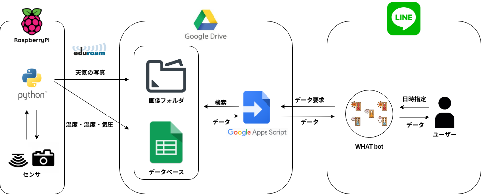

# line_seminar_gas

4年後期 電気電子セミナーで作成したアプリのクライアント側のリポジトリです。

ある地点における環境データをチャットアプリ（LINE）を利用し、非同期で取得できるチャットボットを作りました。
LINEのMessaging APIを利用し、Spreadsheetからデータを参照する構成にしました。

制作した[ポスター](doc/電気電子セミナーポスター.pdf)、[スライド](doc/電気電子セミナー成果報告.pdf)に詳しい説明があります。
